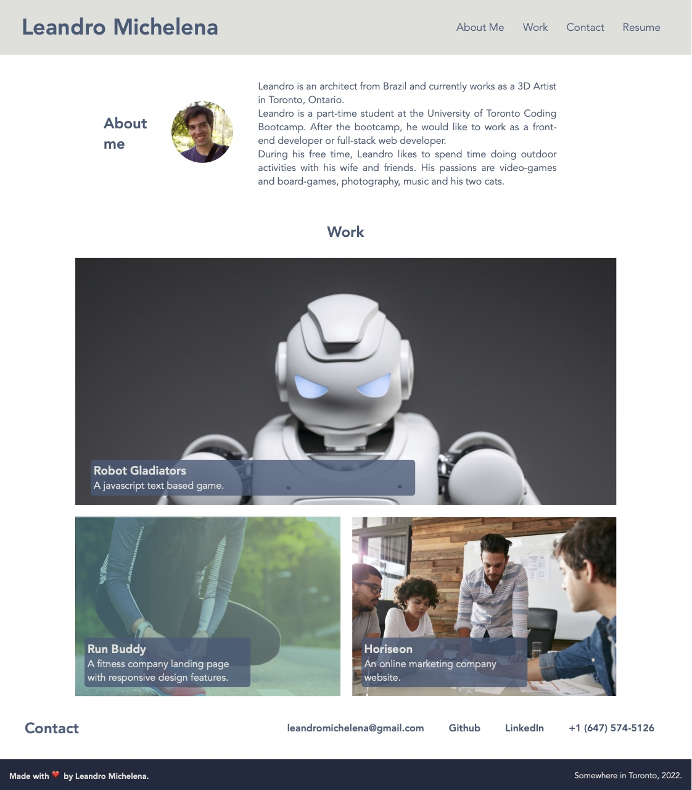

# Portfolio-Page
Website that showcases my coding bootcamp projects. Built using HTML and CSS. 

## About This Repository
This repository contains the working files for the Coding Bootcamp Weekly Challenge 2.  
The objective of this exercise is to demonstrate the CSS techiniques learned during the second module of the course. The website contains links to work done in previous modules and will be expanded to include future work.  
The main challenge was to use advanced CSS techniques to create visual enhancements and make the page responsive to different screen sizes.

## Website
https://www.leandromichelena.com/

## Page Screengrab

## Built With
* HTML
* CSS

## Support
If you find any bugs or have any questions, please contact me on Github.

## Authors and Acknowledgment
HTML and CSS Created by Leandro Michelena.
Robot Image from Pavel Danilyuk - Pexels.
Projects displayed are based on the code provided by Trilogy Education Services, a 2U, Inc. brand.

## License
MIT License
